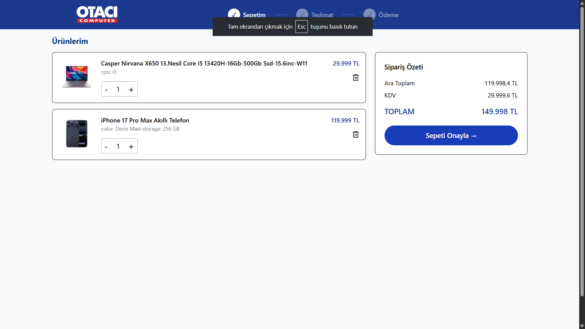
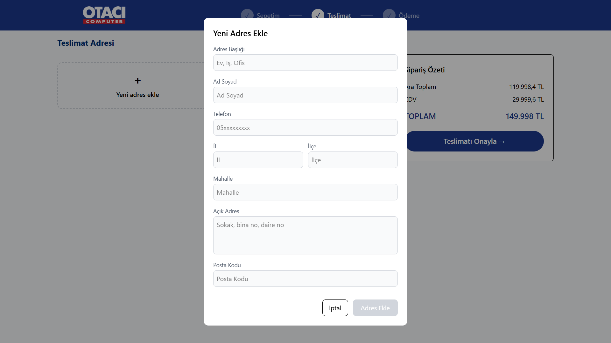
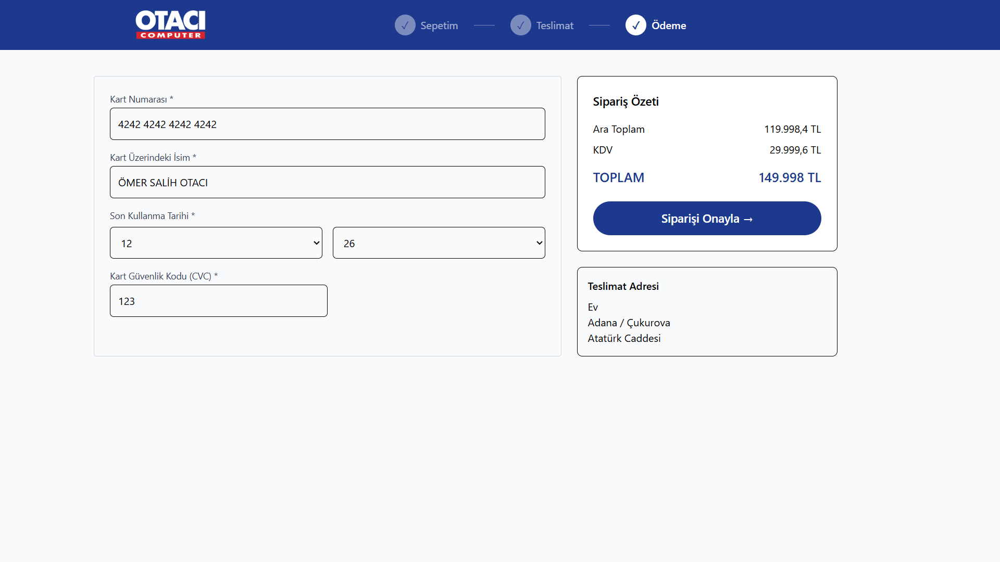

# 🛒 Vatan Computer Clone – Full-Stack E-Commerce Platform

A production-ready full-stack e-commerce application inspired by Vatan Computer.  
Built to practice real-world backend architecture, authentication, variant-based product systems, and containerized deployment.

⚠️ Disclaimer  
This project is developed for educational purposes only.  
It is not affiliated with or endorsed by Vatan Computer. No commercial use is intended.

---

## 🔗 Live Demo

🌐 Frontend  
https://otacicomputer.netlify.app/

📚 Swagger API Documentation  
https://vatan-computer-clone.onrender.com/swagger-ui/index.html

---

## 🔐 Demo Account

You can use the following demo account to test authentication, cart, and checkout flow:

Email: testuser@gmail.com  
Password: test1234  

---

## 🛠 Tech Stack

### Backend
- Java 17
- Spring Boot 3
- Spring Security (JWT Authentication)
- Spring Data JPA
- PostgreSQL
- MapStruct (DTO Mapping)
- Global Exception Handling
- Docker (Multi-stage build)

### Frontend
- React (Vite)
- React Router
- React Query
- Context API
- Custom Hooks
- TailwindCSS

### DevOps
- Dockerized backend
- Render (Backend deployment)
- Netlify (Frontend deployment)
- Environment variable configuration

---

## ✨ Key Features

- 🔐 JWT-based authentication & protected routes
- 🛍 Variant-based product system (color, storage, stock-aware pricing)
- 📂 Hierarchical category structure
- 🔎 Dynamic filtering (brand, price intervals)
- 🛒 Cart management (add, remove, update quantity)
- 🧾 Checkout flow (address management + order summary)
- 💳 Payment UI simulation
- 📊 Structured error responses with global exception handler
- 📦 Dockerized backend for production consistency

---

## 🏗 Architecture Overview

### Backend

Layered architecture:

Controller → Service → Repository  

- DTO pattern using MapStruct  
- Custom error handling (`ApiException`, `ErrorCode`, `ErrorResponse`)  
- Centralized `GlobalExceptionHandler`  
- JWT Security configuration  
- Clean package structure  

```
backend/
 ├── config/
 ├── controller/
 ├── dto/
 ├── entity/
 ├── exception/
 ├── mapper/
 ├── repository/
 ├── service/
 └── Dockerfile
```

---

### Frontend

Modular React architecture:

```
frontend/src/
 ├── api/
 ├── components/
 ├── context/
 ├── hooks/
 ├── layout/
 ├── pages/
 ├── router/
 └── main.jsx
```

- API abstraction layer  
- Context-based state management  
- Reusable component structure  
- Clean routing organization  

---

## 🖼 Screenshots

### Home Page


### Featured & Bestseller Sections


### Dynamic Filtering System


### Authentication Flow


### Cart Page


### Address Management


### Payment Page


---

## 🔐 Environment Variables

### Backend
- SPRING_DATASOURCE_URL
- SPRING_DATASOURCE_USERNAME
- SPRING_DATASOURCE_PASSWORD
- JWT_SECRET

### Frontend
- VITE_API_BASE_URL

---

## 📦 Deployment

- Backend containerized with Docker (multi-stage build)
- Deployed to Render
- Frontend deployed to Netlify
- Continuous deployment on push to main branch

---

## 📈 What This Project Demonstrates

- Full-stack application design
- RESTful API development
- Secure authentication with JWT
- Clean architecture principles
- Production deployment workflow
- Docker-based containerization
- Real-world e-commerce flow implementation

---

## 📄 License

This project is developed for educational purposes only.
